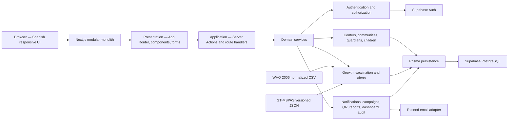

# System and component architecture

```mermaid
flowchart LR
  Browser["Browser — Spanish responsive UI"] --> App["Next.js modular monolith"]
  App --> Presentation["Presentation — App Router, components, forms"]
  Presentation --> Application["Application — Server Actions and route handlers"]
  Application --> Domain["Domain services"]
  Domain --> Authz["Authentication and authorization"]
  Domain --> Registry["Centers, communities, guardians, children"]
  Domain --> Clinical["Growth, vaccination and alerts"]
  Domain --> Operations["Notifications, campaigns, QR, reports, dashboard, audit"]
  Authz --> SupabaseAuth["Supabase Auth"]
  Registry --> Persistence["Prisma persistence"]
  Clinical --> Persistence
  Operations --> Persistence
  Persistence --> Postgres["Supabase PostgreSQL"]
  Operations --> Resend["Resend email adapter"]
  WHO["WHO 2006 normalized CSV"] --> Clinical
  MSPAS["GT-MSPAS versioned JSON"] --> Clinical
```
