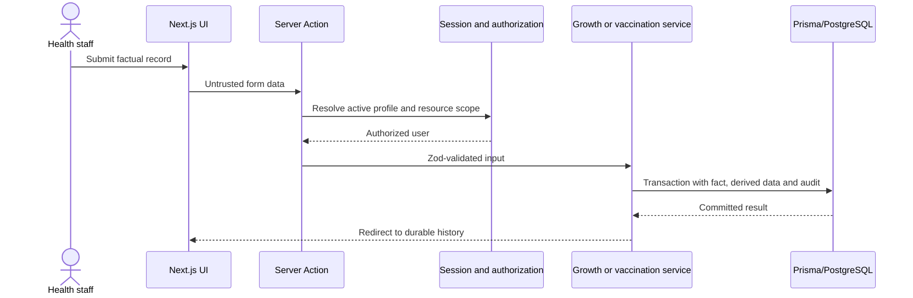
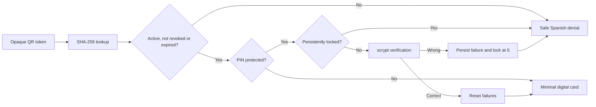

# Critical workflows

## Protected factual record

```mermaid
sequenceDiagram
  actor Staff as Health staff
  participant UI as Next.js UI
  participant Action as Server Action
  participant Auth as Session and authorization
  participant Domain as Growth or vaccination service
  participant DB as Prisma/PostgreSQL
  Staff->>UI: Submit factual record
  UI->>Action: Untrusted form data
  Action->>Auth: Resolve active profile and resource scope
  Auth-->>Action: Authorized user
  Action->>Domain: Zod-validated input
  Domain->>DB: Transaction with fact, derived data and audit
  DB-->>Domain: Committed result
  Domain-->>UI: Redirect to durable history
```

## Public QR access

```mermaid
flowchart LR
  Scan["Opaque QR token"] --> Hash["SHA-256 lookup"]
  Hash --> Availability{"Active, not revoked or expired?"}
  Availability -->|No| Deny["Safe Spanish denial"]
  Availability -->|Yes| Pin{"PIN protected?"}
  Pin -->|No| Card["Minimal digital card"]
  Pin -->|Yes| Lock{"Persistently locked?"}
  Lock -->|Yes| Deny
  Lock -->|No| Verify["scrypt verification"]
  Verify -->|Wrong| Attempts["Persist failure and lock at 5"] --> Deny
  Verify -->|Correct| Reset["Reset failures"] --> Card
```
