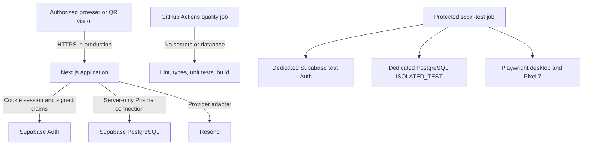

# Deployment architecture

```mermaid
flowchart TB
  User["Authorized browser or QR visitor"] -->|"HTTPS in production"| Web["Next.js application"]
  Web -->|"Cookie session and signed claims"| Auth["Supabase Auth"]
  Web -->|"Server-only Prisma connection"| DB["Supabase PostgreSQL"]
  Web -->|"Provider adapter"| Email["Resend"]
  CI["GitHub Actions quality job"] -->|"No secrets or database"| Build["Lint, types, unit tests, build"]
  E2ECI["Protected sccvi-test job"] --> TestAuth["Dedicated Supabase test Auth"]
  E2ECI --> TestDB["Dedicated PostgreSQL ISOLATED_TEST"]
  E2ECI --> Browser["Playwright desktop and Pixel 7"]
```

No staging or production hosting provider is selected. CI does not deploy or
apply database migrations.
